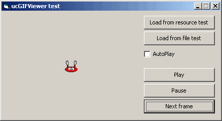



## ucGIFViewer 1\.0

### Description

This code is based on the excellent post by Vlad Vissoultchev: VB Gif Library (CodeId=44216). Simply, minor modifications for building an easy to use usercontrol.
 
### More Info
 

             |
---                |---
**Submitted On**   |2003-12-06 22:10:42
**By**             |[Carles P\.V\.](https://github.com/Planet-Source-Code/PSCIndex/blob/master/ByAuthor/carles-p-v.md)
**Level**          |Intermediate
**User Rating**    |5.0 (70 globes from 14 users)
**Compatibility**  |VB 6\.0
**Category**       |[Graphics](https://github.com/Planet-Source-Code/PSCIndex/blob/master/ByCategory/graphics__1-46.md)
**World**          |[Visual Basic](https://github.com/Planet-Source-Code/PSCIndex/blob/master/ByWorld/visual-basic.md)
**Archive File**   |[ucGIFViewe1763046282004\.zip](https://github.com/Planet-Source-Code/carles-p-v-ucgifviewer-1-0__1-46349/archive/master.zip)

